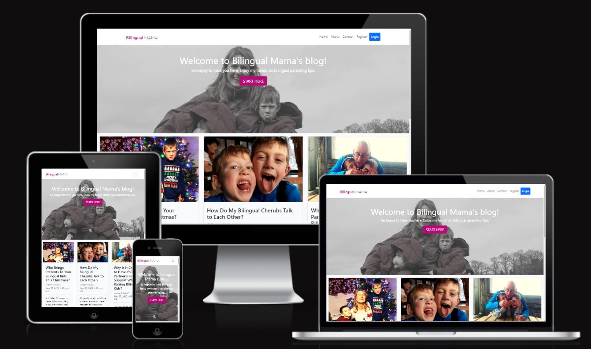
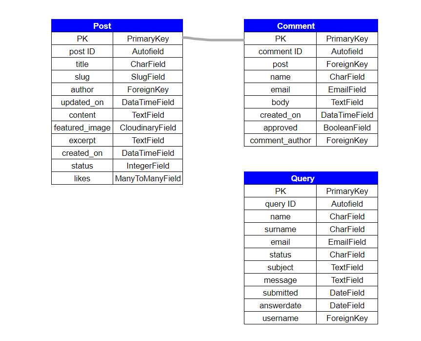

# BILINGUAL MAMA

This is my 4th project for my Diploma in Software Dev Course and it’s been built for educational purposes only. 

The purpose of the website is to inspire bilingual mums (and dads!) to raise fully bilingual and multicultural children that are used to “live and learn” in two languages simultaneously. 

This website is designed to be responsive and accessible on a range of devices, making it easy to navigate for the audience.

## Showcase

A deployed link to the website can be found [here.](https://bilingual-mama.herokuapp.com/)

## User Experience (UX)

### Strategy

#### **User Stories**

The target audience (end users) of this project are bilingual females (but also males) from the age of 25+ who live abroad and are looking for hands-on information about raising bilingual children in an environment where the minority (their own) language is not spoken readily. It is aimed at this type of audience as my personal story (“bilingual mum of two trying to bring up her children bilingual so that they can understand and speak her language as natives”) can resonate with them.

The end user is looking for inspiration and hands-on advice and how-tos, not scientific theories.

The benefit of this project is to highlight that bilingual parenting can be a very tricky and time-consuming task however, if you have a sound ‘strategy and you persist, you will “bear the fruit of your labour” eventually, as long as you’re patient and consistent.

Other features that are not to be missed is that the users can, if they wish, get in touch to obtain more parenting advice by sending a contact form and also asking questions when commenting on the relevant blog posts. They can also easily navigate to the social links.

#### **Site user/ Blog reader Goals**
- As a site user/blog reader I can view a paginated list of posts so that I can easily select a post to view
- As a Site User/blog reader I can view a list of posts so that I can select one to read
- As a Site User/blog reader I can click on a post so that I can read the full text
- As a Site User/ Blog reader I can register an account so that I can comment and like
- As a Site User/ Blog reader I can leave comments on a post so that I can be involved in the conversation
- As a Site User/ Blog reader I can edit my own comments on a post
- As a Site User/ Blog reader I can delete my comments on a post
- As a Site User/ Blog reader I can like or unlike a post so that I can interact with the content
- As a Site User/ Blog reader I can navigate easily through the website so that I can find the information I am looking for
- As a Site User / Blog reader I can view the About page so that I can find out more about the blogger and the purpose of her blog
- As a Site User/ Blog reader I can get in touch with the blogger so that I can submit my questions to her
- As a Site User/ Blog reader I can check the blogger’s social media accounts so that I can be a part of her community and get updates on her content

#### **Site owner/ Blogger / Admin Goals**
- As a Site Owner/ Blogger / Admin I can view the number of likes on each post so that I can see which is the most popular or viral
- As a Site Owner/ Blogger / Admin I can view comments on an individual post so that I can read the conversation
- As a Site Owner/ Blogger / AdminI can create, read, update and delete posts so that I can manage my blog content
- As a Site Owner/ Blogger / AdminI can create draft posts so that I can finish writing the content later
- As a Site Owner/ Blogger / AdminI can approve or disapprove comments so that I can filter out objectionable comments

## Scope

To achieve the above goals I have implemented the following features:

## Features

Bilingual Mama is a personal blog that includes several pages: Home/ Blog, About, Contact, Register and  Login.

### Navigation Bar

The responsive navigation bar includes links to Home page/Blog, About, Contact, Register and Login. Once a registered user loggs in the login link is replaces a Logout link in the navbar.
This section is linked to other relevant sections of this blog which allows the user to navigate through the page easily.

### The landing Page Image

The landing page includes an outdoor family photograph of the blogger with her children.

### About Page

This section tells an authentic personal story and creates connection with a reader that is being introduced to hands-on bilingual parenting practices that have been tried out by the blogger and other multilingual parents to teach their children their native (minority) language. 
As this is a blog the main focus is the content shared rather than the images, however, the images are used to entice readers and create know-like-trust factor.

### Contact page

This page contains a contact form that includes contact details fields, status field to find out more about the user, subject line, text area for the message and submit button.

### Registration Page

This page enables the blog user to register in order to comment and like or unlike blog posts. It contains a form that includes Username and an optional email fields, password and password confirmation field, and a sign-up button.

### Login

This page enables the blog user to log in in order to comment and like or unlike blog posts.This page contains a form that includes Username and  password and password fields, remember-me checkbox and a sign-in button.

### Logout

This page the user to log out and contains a sign-out button. 

## Other Features

### Blog post overview

Blog overview section that lists up to 6 blog posts on the page the user is currently on. Each individual blog post view containing an image, tagline, author's name, date when published and a snippet of the blog post.

### Pagination

At the bottom of the blog overview there's a pagination directing the user to go to the next or previous page.

### Footer

A footer is located right at the bottom of the page and contains social media links.

### Individual blog post view

Each individual blog post includes the content, but also a header, and below the section to comment and like/unlike provided they are registered and logged in.

### Error pages

Error pages (404 and 500) are available to the user provided something goes wrong, eg. they are trying to look for link or content that does not exist.

### CRUD Functionality

Full CRUD funtionality is available to a registered/logged-in user to be able to submit, update and delete comments and like blog posts.

### Query form 
Submitted contact form information is available to the admin/blogger in the admin panel under Queries.

## Design

Originally, I have created a colour palette with canva that was based on my hero image in full colour, however, I was not happy with the colours and have changed them as I was designing. Instead of the original colour palette colours the following colours have been used: #b50c74, #fff, #4a4a4a and #0275d8.

## Typography

Typography was based on the Django blog Walktrough project.

## Wireframes

Wireframes were created using Canva. !!!!!ATTACH HERE!!!!

## Database

I have used a relational database for this project. SQLite/Postgress was used as the main database, all data migrated to Heroku and then due to the recent Heroku changes it was successfully migrated to ElephantSQL.

I have created a separate Queries app and inclueded my custom model:

- contact: contains information about the user
- status: contains additional information (eg parental status, blogger status)
- subject: contains subject line
- message: contains user's message
- answerdate: could be added in admin when messages answered
- user: contains information about the user

## Technologies Used

### Languages Used
- HTML5, Boostrap framework
- CSS3
- JavaScript
- Python, Django library
- SQLLite/Postgress

### Frameworks, Libraries and Programs Used

- Canva.com: Canva Color Palette Generator was used to create a color palette and Canva was used to create a mock-up design, and for resizing and editing images.
- Git: Git was used for version control by utilizing the Gitpod terminal - to commit to Git and push to GitHub
- GitHub: Github is used to store the project's code after being pushed from Git.
- GoogleDev Tools used to see the element positioning and responsiveness
- [Google Fonts](https://fonts.google.com/): Google fonts ‘Lato’ and 'Roboto' were used. 
- favicon.io was used to create the favicon
- FontAwesome used for social media icons: FB, IG, YT
- Google sheets used for database modeling
- Coudinary: for storing images
- [amiresponsive](http://ami.responsivedesign.is/) was used to create the mockup for Readme
- Validation services: W3C Markup Validation, W3C CSS Validation, jshint and PEP8 Validation - see the TESTING.md for more details

---

## TESTING

I have tested this project manually and completed also some auto testing via the online validation services. See the full details on a separate page [HERE.](https://github.com/psnaz/bilingual-mama/blob/main/TESTING.md)

---

## DEPLOYMENT

### CREATING A DJANGO APP

The following steps had to be taken to create the Django app:

1. Go to Github and
2. Create a new repository using the CI template
3. Create a workspace  by clicking the green Gitpod button in your new repository page
4. Carry out an initial commit
5. Install Django and gunicorn: `pip3 install django gunicorn`
6. Install any supporting libraries: `pip3 install dj_database_url_psycopg2`
7. Create requirements.txt file: `pip3 freeze --local > requirements.txt`
8. Create Django project: `django-admin startproeject yourprojectname`
9. Create an app within the project: `python3 manage.py startapp yourappname `
10. Add your created app to the list of installed apps in settings.py 
11. Make migrations: `python3 manage.py makemigrations`
12. Migrate your changes: `python3 manage.py migrate`
13. Test by running your server locally: `python3 manage.py runserver`
14. Create procfile: `python3 run.py > Procfile`
15. Push your changes to Github: `git add .` | `git commit -m “Commit message here”` | `git push`

Once this is done, you can start deployment to Heroku

### Deployment to Heroku

This site was deployed to Heroku pages by taking the following steps:

Go to Heroku and
1. Create Heroku account, log in and go to the Dashboard
2. Click `“NEW”`
3. Click `“CREATE NEW APP”`
4. Give your app a name and select the region closest to you (eg. Europe). Click `“CREATE APP”` to confirm

As the database provided by Django is not suitable for a production enviroment, you have to create a new database in ElephantSQL.com and transfer the data from your IDE to your new database. 
5. Create ElephantSQL account, log in and go to your dashboard.
6. Click `“CREATE NEW INSTANCE”`
7. Set up your plan: Give it a NAME (usually the name of your project), select the free Plan (called Tiny Turtle), leave the tags blank
8. Click `“SELECT REGION”`
9. Select your closest data centre from the dropdown menu
10. Click `“REVIEW”`
11. Check if your details are correct and click `“CREATE INSTANCE”`
12. Return to the ElephantSQL dashboard and click on your database instance name.
13. In the URL section, click the copy icon to copy your new database URL

Go to your project workspace (eg. Gitpod) and
14. create `env.py`. Remember to include this file in `.gitignore` file as env.py mustn’t be included in your Github repository.
15. In your env.py file add the following code: `import os`   
16. You need to set environment variables: 
 First add a blank line, then set a DATABASE_URL variable with the value copied from ElephantSQL (step 13.) Your code should look like this: `os.environ[“DATABASE_URL”]=”<your copied string from ElephantSQL>”`   
17. To encrypt session cookies in Django application, you have to set up your SECRET_KEY in the env.py which can be anything. Your code should look like this: `os.environ[“SECRET_KEY”]=”wh@t_ever_you_made+up-comes!here”`
18. Save the env.py file
19. To make your Django project aware of the env.py file, open your settings.py and add the following code below your Path import: 
 `import os`
 `import dj_database_url`
 `if os.path.isfile(‘env.py’)`
20. Further down, remove the insecure secret key provided by Django and change your SECRET_KEY variable to:
 `SECRET_KEY = os.environ.get(‘SECRET_KEY’)`
21. To hook up your database, scroll down in your settings.py file to the database section.
22. Comment out the original DATABASES variable and add the code below:
 `DATABASES = {‘default’: dj_database_url.parse(os.environ.get(“DATABASE_URL”))}`
23. Save your settings.py. Your app will now be connected to your remote database hosted on ElephantSQL
24. Migrate these changes: `python3 manage.py migrate`

Once migrated go over to your ElephantSQL account and
25. select your database instance and select the `“BROWSER”` on the left.
26. Click `“TABLE QUERIES”` to see a dropdown list and your database structure. SQL Query list must have populated from your Django migrations.

Head back to your Gitpod workspace and
27. Add, commit and push your project to GitHub again. Your Gitpod workspace is now connected to your ElephantSQL database.

Now you have to connect your new ElephantSQL database to Heroku, so head back to your Heroku dashboard and
28. Click on the Settings tab
29. Set the following config vars: 
`DATABASE_URL` and add the URL of your ElephantSQL database as a value, 
`CLOUDINARY_URL` and add the URL of your Cloudinary acc (if you are using Cloudinary for storage of images),
`SECRET_KEY` that contains your secret key, and 
`PORT` with a value of 8000, also
`DEBUG` and add True as a value, 
`DISABLE_COLLECTSTATIC` and add 1 as a value.

In the Gitpod workspace update your settings.py:
30. Set DEBUG to True

In Heroku account 
31. click the `Deploy tab` and as deployment method select `Github` and click the `connect to Github`
32. Search for your repository name, once found, `connect`.
33. Scroll down to `Manual deploy` and click `‘Deploy branch’`. Your app will be built.

Once your ‘App was successfully deployed’ message appears and button with your deployed link, you can click on it to see your app.

## Forking the GitHub Repository OR Making a Local Clone

If you are interested how to fork this repository or how to make a local clone, this information can be found in Github documentation [here](https://docs.github.com/en/repositories/creating-and-managing-repositories/cloning-a-repository).

---

## Credits

### Code

- The majority of the code came from the Django Walkthrough project and the Diploma in Software Development study materials, my notes taken during going through the materials and by working with Google DevTools - trial and error approach.

- Additonal knowledge used from the following courses: [The Boostrap 4 Camp](https://www.udemy.com/course/bootstrap-4-bootcamp/)

- [MDN Web Docs](https://developer.mozilla.org/en-US/): Used extensively to deepen my knowledge and understanding of HTML and CSS, and chek for ideas and solutions, specifically:  

- For Contact form/ Query model: Youtube [Django Tutorial #9: A More Complex Form (2022) by Django tutorials](https://www.youtube.com/watch?v=-qAf_Qx6Ygg)

- [Djangoproject documentation](https://docs.djangoproject.com/en/4.1/)

- Stackoverflow

- For 404 and 500 Error pages [this youtube tutorial](https://www.youtube.com/watch?v=zSEexM0GspU) and [this article](https://freefrontend.com/html-funny-404-pages/)

-  Mentor’s advice, especially when creating the template and urls for the Query model to render correctly.

### Content

- All content was written by the developer. 

### Media

- All media created by the developer.

### Acknowledgements

- My family for their patience and support
- My Mentors Guido Cecilio and Chris Quinn for their patience and great insights.
- Tutor support at Code Institute for their support.
- Code Institute Slack Community for all their advice and support.

------