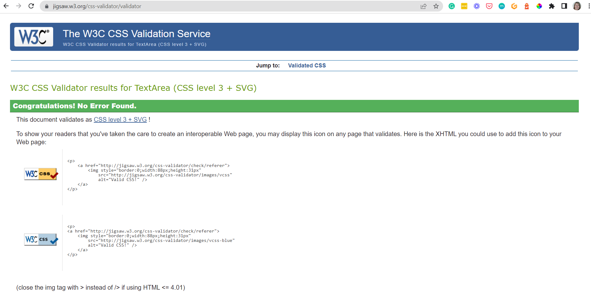

# TESTING

## Code Validation
The below online validation tools were used to validate the project pages to ensure that there were no syntax errors in the project.

### HTML Validator
See the screenshot below for HTML code test results run with [HTML Validator.](https://validator.w3.org/) No errors detected.

### CSS Validator
See the screenshot below for CSS code test results run with [CSS Validator.](https://jigsaw.w3.org/css-validator/) No errors detected.

### JavaScript Validator
See the screenshot below for JavaScript code test results run with [JavaScript Validator.](https://jshint.com/)

### Python Validator
See the screenshot below for Python code test results run with [Python Validator.](https://pep8ci.herokuapp.com/)

## Lighthouse Test

See the screenshot below for the Lighthouse test results run with [Lighthouse Chrome Extension.](https://chrome.google.com/webstore/detail/lighthouse/blipmdconlkpinefehnmjammfjpmpbjk) When tested for Performance, Accessibility, Best Practices and SEO, good results were achieved.

## Responsiveness Test

## Browser Compatibility Test

## Features Test

## Showcase

A XXX link can be found [here.](https://bilingual-mama.herokuapp.com/)

#### **User Stories**

The target audience (end users) of this project are bilingual females (but also males) from the age of 25+ who live abroad and are looking for hands-on information about raising bilingual children in an environment where the minority (their own) language is not spoken readily. It is aimed at this type of audience as my personal story (“bilingual mum of two trying to bring up her children bilingual so that they can understand and speak her language as natives”) can resonate with them.

The end user is looking for inspiration and hands-on advice and how-tos, not scientific theories.

The benefit of this project is to highlight that bilingual parenting can be a very tricky and time-consuming task however, if you have a sound ‘strategy and you persist, you will “bear the fruit of your labour” eventually, as long as you’re patient and consistent.

Other features that are not to be missed is that the users can, if they wish, get in touch to obtain more parenting advice by sending a contact form and also asking questions when commenting on the relevant blog posts. They can also easily navigate to the social links.

#### **Site user/ Blog reader Goals**
- As a site user/blog reader I can view a paginated list of posts so that I can easily select a post to view
- As a Site User/blog reader I can view a list of posts so that I can select one to read
- As a Site User/blog reader I can click on a post so that I can read the full text
- As a Site User/ Blog reader I can register an account so that I can comment and like
- As a Site User/ Blog reader I can leave comments on a post so that I can be involved in the conversation
- As a Site User/ Blog reader I can like or unlike a post so that I can interact with the content
- As a Site User/ Blog reader I can navigate easily through the website so that I can find the information I am looking for
- As a Site User / Blog reader I can view the About page so that I can find out more about the blogger and the purpose of her blog
- As a Site User/ Blog reader I can get in touch with the blogger so that I can submit my questions to her
- As a Site User/ Blog reader I can check the blogger’s social media accounts so that I can be a part of her community and get updates on her content

#### **Site owner/ Blogger / Admin Goals**
- As a Site Owner/ Blogger / Admin I can view the number of likes on each post so that I can see which is the most popular or viral
- As a Site Owner/ Blogger / Admin I can view comments on an individual post so that I can read the conversation
- As a Site Owner/ Blogger / AdminI can create, read, update and delete posts so that I can manage my blog content
- As a Site Owner/ Blogger / AdminI can create draft posts so that I can finish writing the content later
- As a Site Owner/ Blogger / AdminI can approve or disapprove comments so that I can filter out objectionable comments

